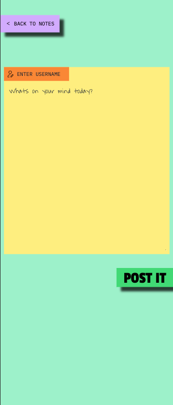

# Just Post It - Individual Examination - Frontend

## Description
Just Post It is a single-page application (SPA) built with React and Vite that allows users to post and edit notes. It is styled using Tailwind CSS and hosted on AWS using an S3 bucket. 

## Table of Contents
1. [Purpose](#purpose)
2. [Features](#features)
3. [Screenshots](#screenshots)
4. [React Hooks](#react-hooks)
5. [Installation and Running the Project](#installation-and-running-the-project)
6. [Error Handling](#error-handling)

## Purpose
Just Post It is designed as a simple note-posting platform where users can add, edit, and view notes.

## Features
- Post a new note with a username and message.
- Edit an existing note.
- View all notes.
- Sort notes by date or user.

## Screenshots



## React Hooks
- **useEffect**: Handles asynchronous operations like data fetching when the component mounts or updates. Used to fetch:
   - All notes (when the landing page loads).
   - User-specific notes or single notes (for the edit feature).
- **useState**: Manages component-level state, including:
   - Notes data (fetched from the backend).
   - Form data for posting and editing notes.
   - UI state such as success and error messages.

## Installation and Running the Project
Before running the project, ensure you have the following installed:
- **Node.js**: [Download and install Node.js](https://nodejs.org/) if you don’t have it already.
- **npm or yarn**: Make sure to have either npm (comes with Node.js) or yarn installed.

### Steps:
1. **Clone the repository**:
   ```bash
   git clone git@github.com:Mayonesa90/just-post-it.git

2. Navigate to the project directory:
   ```bash
   cd just-post-it/frontend/just-post-it-frontend

3. Install dependencies:
   ```bash
   npm install

4. Start the development server:
   ```bash
   npm run dev

5.	Open the app in the browser:
   By default, it should be running on http://localhost:3000

## API Information
The frontend communicates with the backend API to fetch, create, and update notes. Here are the main API endpoints:
- `GET /notes`: Fetch all notes.
- `POST /notes`: Create a new note.
- `GET /notes/:id`: Fetch a specific note.
- `PUT /notes/:id`: Update an existing note.
- `DELETE /notes/:id`: Delete a note

## Error Handling
Error handling is mainly done on the backend. The frontend displays error messages from the backend using toast notifications or inline messages. Common error cases include:
- Failed form submissions due to missing or invalid data (e.g., username less than 3 characters).
- API request failures (e.g., network issues or server-side errors).


